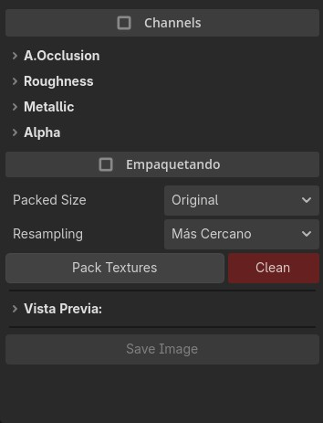

# RGBA Texture Packer for Godot

A powerful and flexible Godot editor plugin that allows you to pack multiple textures into a single RGBA image directly inside the editor.

Designed for production workflows, this tool provides full control over channel selection, inversion, resolution scaling, resampling methods, and real-time preview.

Compatible with Godot 4.x.

---

## Features

### Channel Packing (RGBA)

- Assign a different texture to each RGBA channel.
- For each assigned texture, you can:
  - Select which channel to use:
    - Red
    - Green
    - Blue
    - Alpha
    - Luminance
  - Invert the selected channel before packing.

This allows maximum flexibility when creating:
- ARM maps (AO, Roughness, Metallic)
- ORM maps
- Custom mask textures
- Any multi-channel packed texture

---

### Resolution Control

When exporting the packed texture, you can:

- Keep the original resolution
- Resize to one of the following presets:
  - 512 x 512
  - 1024 x 1024
  - 2048 x 2048
  - 4096 x 4096

This makes it easy to standardize texture sizes across your project.

---

### Resampling Methods

When resizing, you can choose between:

- Closest
- Linear
- Lanczos

This gives you full control over quality versus performance depending on your needs.

---

### Real-Time Preview

The preview panel allows you to:

- View the final packed RGBA texture
- Switch to preview individual channels (R, G, B, A)

This helps you quickly verify the output before exporting.

---

### Export

At the bottom of the interface, a save button allows you to:

- Choose the destination folder
- Select the filename
- Export the packed image directly from the editor

---

## Typical Use Cases

- Creating ARM (AO-Roughness-Metallic) textures
- Packing masks for shaders
- Optimizing material workflows
- Reducing texture memory usage
- Preparing assets for game-ready pipelines

---

## Installation

1. Download or clone this repository.
2. Copy the `addons` folder into your Godot project.
3. Open **Project > Project Settings > Plugins**.
4. Enable the plugin.

The tool will appear in the right dock panel.

---

## Requirements

- Godot 4.x
- Tested in Godot 4.6

---

## License

This project is licensed under the MIT License.
